# 基于预渲染顶点色的水编辑器（适用移动端）

效果预览：

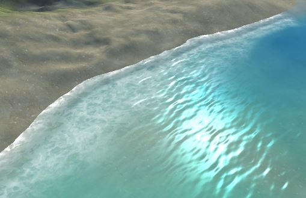

## 一、说明：

针对移动平台编写的水材质shader，考虑到各方面性能因素，为了实现类似基于深度图的水体深浅效果，采用预先从上往下渲染深度图并映射到Mesh顶点色的方式实现：

映射到顶点的Mesh效果：

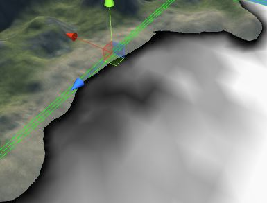

但采用该方式需要高度依赖Mesh的顶点数量与分布，这样一方面如果交由美术制作Mesh则制作成本较高，且不容易控制顶点的分布，修改也比较麻烦，另一方面通过程序生成简单的mesh又需要较高的顶点数才能满足效果要求，如下，高顶点数下顶点色过渡才会比较自然，容易表现出丰富的海浪细节，低顶点数的Mesh无法体现海边波纹的效果：

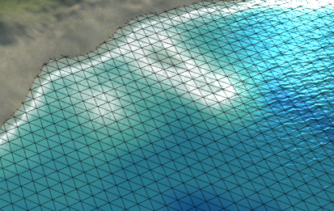

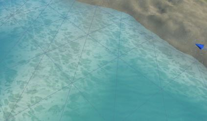

但实际上仅需要控制岸边具有较高顶点数来表现丰富细节即可，对于深海处可以简化mesh，因此改进程序生成Mesh的算法，提供了两种可供使用的方法，

第一种采用基于Lod的Mesh细分方法，对于接近岸边的Mesh，给予最高Lod，将获得最多的顶点数量，而远离岸边的水域，由于不需要过多细节，则给予较低的Lod，只会产生较少顶点，同时对于会被陆地遮挡的部分，则根本不产生顶点，这样即可保证岸边的浪花具有更多细节，如下改进后生成的网格：

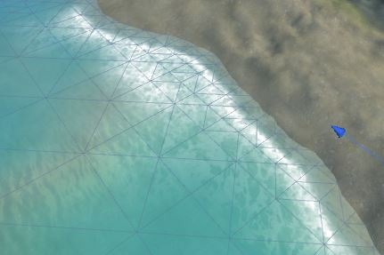

第二种方法采用基于四叉树的方式，先生成叶子节点，针对刚好位于水陆交界处的节点，设置标记，之后自下向上合并节点最终得到四叉树，然后对四叉树生成Mesh，相比上一种方式，其深海处生成的顶点数更少，但细节也会变少。

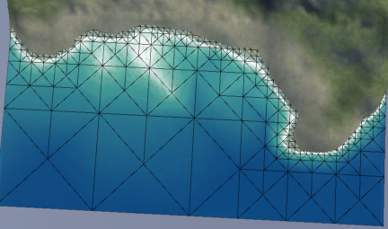

被陆地遮挡部分不会产生三角形：

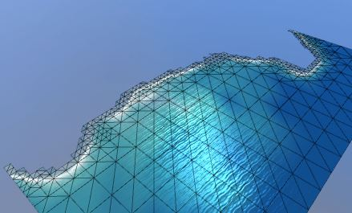

另外编辑器提供了可以自定义绘制顶点色的工具，方便后期调整顶点色。

## 二、使用方法：

### 1.如何生成LodMesh或QuadTreeMesh:

1).点击GameObject/UnlitWater/Create UnlitWater打开编辑器界面

2).在载体目标处拖入一个场景中的GameObject（最好是空的）

3).Mesh生成器类型选择LodMesh或QuadTreeMesh，其中QuadTreeMesh在深海处产生更少顶点

4).参数：

​	调整Width和Height直到整个水面的尺寸

对于LodMesh:

​	调整CellWidth，CellHeight，最大Lod，来调整网格细分粒度，注意蓝线为Lod最低的格子大小，黄线为Lod最高的格子大小：

​	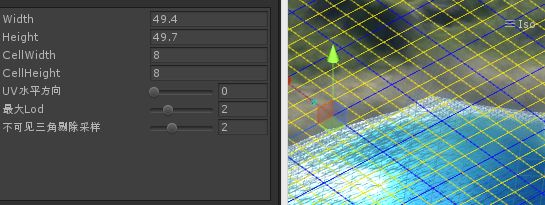

对于QuadTreeMesh:

​	调整深度，来调整网格细分粒度：

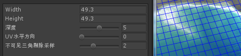

​	调整UV水平方向（这个参数一般需要自己根据需求调节）

​	调整上方高度参数和下方高度参数，使得绿色包围盒的下方刚好到达水体最低部，上方超出陆地最高部，如下：

​	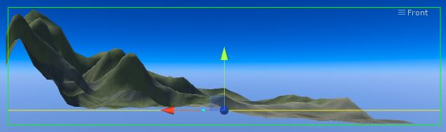

5).点击渲染，生成深度图，该深度图可以保存成文件，同样可以在文件中编辑后再载入到编辑器。另外如果对深度图的深度效果不满意可以调整最大深度范围参数和深度增强参数。

6).点击生成Mesh即可完成操作，生成的Mesh保存成.asset文件并自动附加到载体目标上

### 2.如何应用顶点色到普通的模型Mesh上:

1).打开编辑器

2).将已经在场景中的带有Mesh的物体拖入载体目标，出现提示：“Mesh来自模型文件，需要生成拷贝Mesh”，点击生成拷贝将Mesh拷贝出来

3).同样调整上方高度参数和下方高度参数，使得绿色包围盒的下方刚好到达水体最低部，上方超出陆地最高部

4).点击渲染

5).点击应用到顶点色，完成操作

### 3.如何设置光照方向:

将灯光拖入"平行光"选框，点击设置光照方向

### 4.如何绘制顶点色:

1).打开编辑器

2).拖入已经生成的Mesh的物体到载体目标

3).在顶点绘制中选择绘制通道，并直接在场景中的Mesh上绘制：

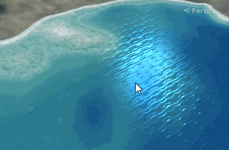

同时可以勾选预览顶点色来开启顶点色的强度预览模式：

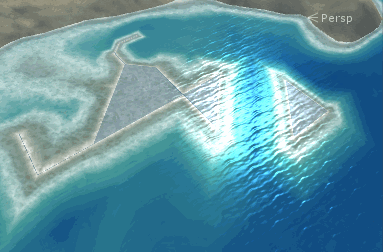

### 5.如何设置材质参数

1).新建材质，选择Unlit/UnlitWater

2).设置泡沫贴图，其中贴图的R通道和G通道分别为海浪泡沫和岸边泡沫，B通道为干扰贴图，干扰海浪的相位

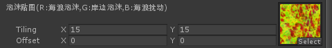

3).设置法线贴图

4).设置海浪渐变映射贴图，其中R通道为海浪渐变贴图，G通道为海浪掩码，从左到又对应海浪从岸边到深水处的遮罩。

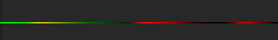

5).设置海水颜色渐变映射贴图，从左往右映射海水的潜水到深水处的颜色

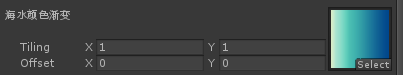

6).设置反射天空盒

7).设置海浪参数，分别对应海浪冲刷的范围，海浪偏移（海浪起始点到陆地的偏移），海浪干扰（根据泡沫贴图B通道），海浪泡沫贴图扰动

8).设置岸边泡沫参数，具体控制岸边泡沫的淡入淡出和宽度

9).设置速度参数，分别控制风速和海浪速度

10).设置法线缩放，菲涅尔系数，高光参数和颜色

11).设置光照方向-该方向不需要手动设置，具体参考步骤3：“如何设置光照方向”

**Ps.编辑器部分采用USubWindow扩展来快速开发EditorWindow，详见：https://github.com/AsehesL/USubWindow**

** 更多内容关注我的博客：http://www.lsngo.net **

